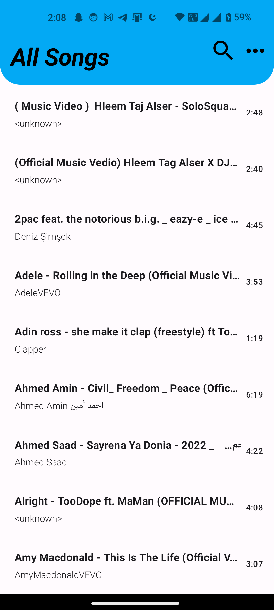
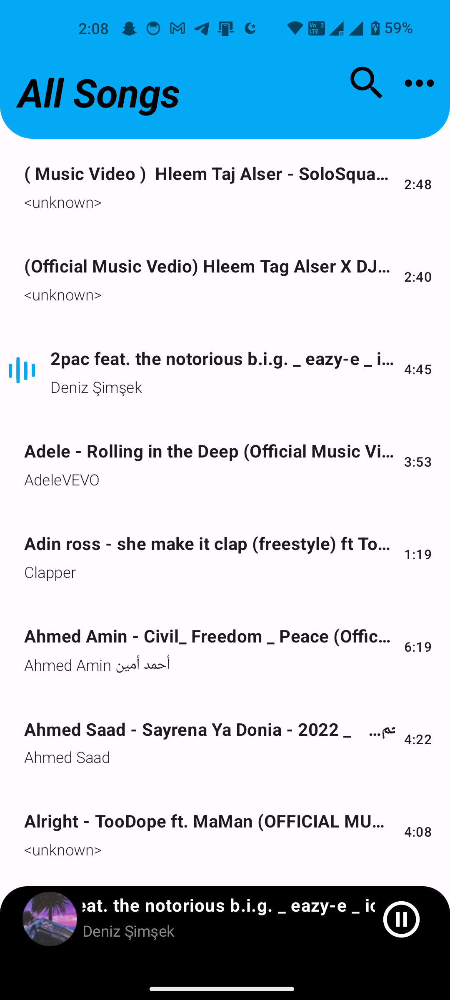
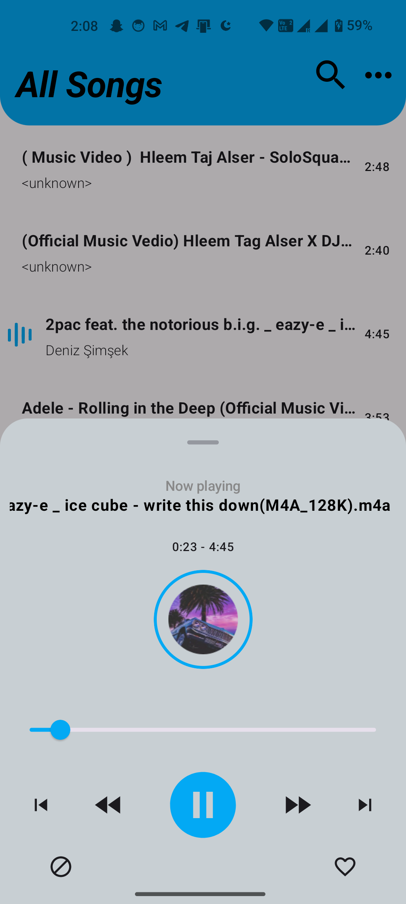

# Vib-Audio Player

  
   

Music Player is an Android application created for playing with Jetpack Compose framework and ExoPlayer.

## Result

### Dark/Light Mode and Notification
|  |  | |
|----------|:----------:|:--------:|:---------:|:---------:|

## Technologies Used

This audio player leverages a range of modern technologies to deliver a robust and efficient application. Below are the key technologies and libraries utilized:

- **[Kotlin](https://kotlinlang.org/)**: The primary programming language used for development, offering concise syntax and strong performance.
  
- **[ExoPlayer](https://github.com/google/ExoPlayer)**: A powerful and flexible media player library used for handling multimedia playback.

- **[Coroutines](https://kotlinlang.org/docs/reference/coroutines-overview.html)**: Utilized for managing asynchronous tasks and simplifying concurrency within the application.

- **[Jetpack](https://developer.android.com/jetpack)**: A comprehensive suite of libraries, tools, and architectural guidance for modern Android development:
  - **[Compose](https://developer.android.com/jetpack/compose)**: A declarative UI toolkit that allows for building responsive and dynamic user interfaces with Kotlin.
  - **[Lifecycle](https://developer.android.com/topic/libraries/architecture/lifecycle)**: Manages lifecycle-aware components to ensure your UI is always in sync with the app’s lifecycle events.
  - **[Flow](https://kotlinlang.org/api/kotlinx.coroutines/kotlinx-coroutines-core/kotlinx.coroutines.flow/-flow/)**: Facilitates the management of asynchronous data streams, enabling efficient and reactive data handling.
  - **[Navigation](https://developer.android.com/jetpack/compose/navigation)**: Handles in-app navigation, including the management of navigation actions and back stack operations.
  - **[ViewModel](https://developer.android.com/topic/libraries/architecture/viewmodel)**: A lifecycle-aware component designed to store and manage UI-related data efficiently.

- **[Koin](https://insert-koin.io/)**: A lightweight and intuitive dependency injection framework for Kotlin, simplifying the management of dependencies.

- **[Coil](https://github.com/coil-kt/coil)**: An image loading library for Android that leverages Kotlin Coroutines for efficient and smooth image loading and caching.

- **[Glide](https://github.com/bumptech/glide)**: An alternative image loading and caching library for Android, offering robust image handling capabilities.

## Features

- **Jetpack Compose Navigation**: Efficiently manages in-app navigation with a modern, declarative approach.
- **MVI Architecture**: Utilizes the Model-View-Intent (MVI) pattern for a clear separation of concerns and reactive UI.
- **Koin for Dependency Injection**: Simplifies dependency management with a lightweight and intuitive DI framework.
- **Local Media Metadata Retrieval**: Extracts metadata from local media files to enhance user experience.
- **Background Playback**: Supports continuous media playback through a foreground service, even when the app is not in the foreground.
- **Media Style Notifications**: Provides notifications that offer controls for media playback directly from the notification shade.
- **MediaSessionService Integration**: Uses a MediaSessionService to manage and expose the current media session for consistent control and interaction.
- **Playback Control Actions**: Includes functionalities for play/pause, skipping to the next/previous track, seeking forward/backward, expanding the bottom sheet to reveal additional options, and stopping playback.

